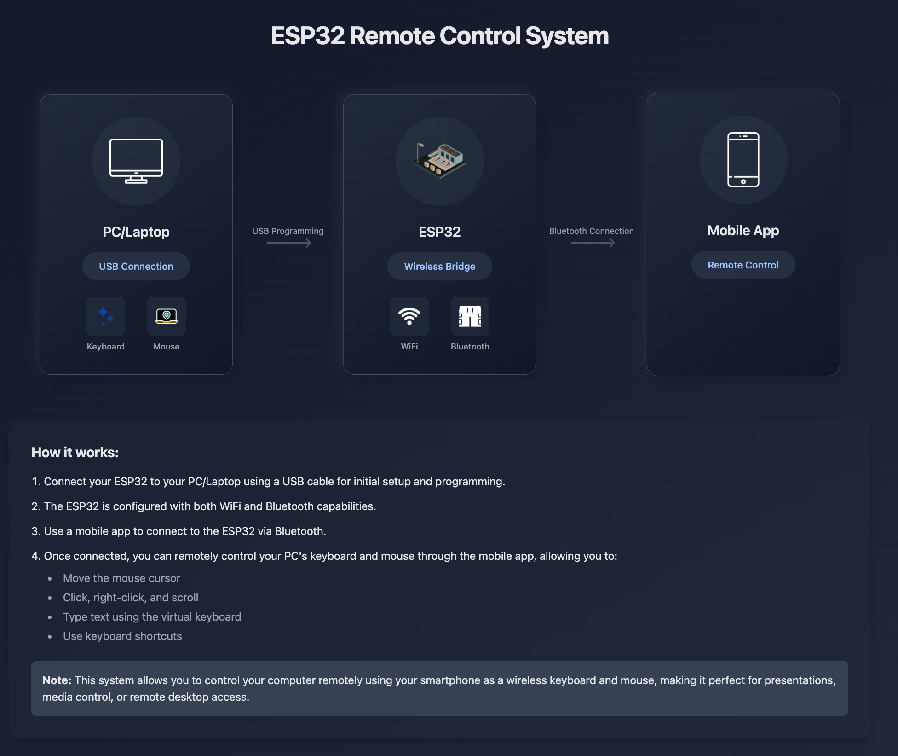

# ESP32 Remote Control System

<p align="center">
  
</p>

A wireless keyboard and mouse control system that allows you to remotely control your PC/Laptop using your smartphone via an ESP32 microcontroller.

## 🌟 Features

- 🖱️ Full mouse control functionality:
  - Cursor movement
  - Left/right click
  - Scroll functionality
- ⌨️ Keyboard capabilities:
  - Virtual keyboard input
  - Keyboard shortcuts support
- 📱 Cross-platform mobile app
- 🔌 Dual connectivity options:
  - WiFi
  - Bluetooth
- 💻 Perfect for:
  - Presentations
  - Media control
  - Remote desktop access
  - Smart home integration

## 🛠️ Hardware Requirements

- ESP32 Development Board
- USB Cable for programming
- PC/Laptop with USB port
- Smartphone with Bluetooth capability

## 📱 Software Requirements

- Arduino IDE or PlatformIO
- ESP32 Board Support Package
- Mobile App (Android/iOS)
- Required Arduino Libraries:
  - BleKeyboard
  - BleMouse
  - WiFi.h
  - BLE.h

## 🚀 Getting Started

### Hardware Setup

1. Connect your ESP32 to your computer using a USB cable
2. Ensure proper power supply to the ESP32
3. Note down the COM port assigned to your ESP32

### Software Installation

1. Clone this repository:

```bash
git clone https://github.com/rakshitbharat/esp32-virtual-keyboard-mouse-combo.git
```

2. Install required libraries in Arduino IDE
3. Configure your ESP32 board in Arduino IDE
4. Upload the firmware to your ESP32

### Mobile App Setup

1. Download the mobile app from releases
2. Enable Bluetooth on your smartphone
3. Connect to the ESP32 device
4. Follow the in-app setup instructions

## 📡 How It Works

1. **Initial Setup**: Connect ESP32 to PC/Laptop via USB for programming
2. **Configuration**: ESP32 is configured with both WiFi and Bluetooth capabilities
3. **Connection**: Mobile app connects to ESP32 via Bluetooth
4. **Control**: Use the mobile app interface to:
   - Move mouse cursor
   - Perform clicks and scrolling
   - Type text using virtual keyboard
   - Execute keyboard shortcuts

## 🔧 Configuration

```cpp
// Example configuration in config.h
#define DEVICE_NAME "ESP32-Remote"
#define BLE_KEYBOARD_ENABLED true
#define WIFI_ENABLED true
```

## 🤝 Contributing

Contributions are welcome! Please feel free to submit a Pull Request. For major changes, please open an issue first to discuss what you would like to change.

1. Fork the Project
2. Create your Feature Branch (`git checkout -b feature/AmazingFeature`)
3. Commit your Changes (`git commit -m 'Add some AmazingFeature'`)
4. Push to the Branch (`git push origin feature/AmazingFeature`)
5. Open a Pull Request

## 📝 License

This project is licensed under the MIT License - see the [LICENSE](LICENSE) file for details.

## 🔍 Troubleshooting

- **Connection Issues**: Ensure Bluetooth is enabled and within range
- **Driver Problems**: Install appropriate USB drivers for ESP32
- **Compatibility**: Check supported devices list

## 📚 Documentation

For detailed documentation, please visit our [Wiki](https://github.com/rakshitbharat/esp32-virtual-keyboard-mouse-combo/wiki)

## ✨ Acknowledgments

- ESP32 Community
- Arduino Community
- All contributors to this project

## 📞 Support

For support, please open an issue in the GitHub repository or contact the maintainers.

---

<p align="center">
Made with ❤️ by the ESP32 Remote Control Team
</p>

# ESP32 Bluetooth LE Keyboard-Mouse Combo

This project implements a Bluetooth Low Energy (BLE) keyboard and mouse combo using an ESP32 microcontroller. It allows you to create a wireless input device that can be connected to computers, tablets, and other Bluetooth-enabled devices.

## Required Libraries

This project depends on the following libraries:

1. [ESP32-BLE-Keyboard](https://github.com/T-vK/ESP32-BLE-Keyboard) - For BLE keyboard functionality
2. [ESP32-BLE-Mouse](https://github.com/T-vK/ESP32-BLE-Mouse) - For BLE mouse functionality
3. [ESP32-BLE-Gamepad](https://github.com/lemmingDev/ESP32-BLE-Gamepad) - For additional gamepad functionality (optional)

## Hardware Requirements

- ESP32 Development Board
- Input components (buttons, joystick, etc.) based on your specific implementation
- Power supply (USB or battery)

## Setup Instructions

1. Install the Arduino IDE
2. Add ESP32 board support to Arduino IDE:
   - Open Arduino IDE
   - Go to File > Preferences
   - Add `https://raw.githubusercontent.com/espressif/arduino-esp32/gh-pages/package_esp32_index.json` to Additional Board Manager URLs
   - Go to Tools > Board > Boards Manager
   - Search for ESP32 and install

3. Install Required Libraries:
   - Go to Sketch > Include Library > Manage Libraries
   - Search for and install the required libraries listed above

4. Configure Board Settings:
   - Select your ESP32 board from Tools > Board
   - Select the appropriate port from Tools > Port

## Usage

1. Clone this repository
2. Open the project in Arduino IDE
3. Configure your input pins in the code
4. Upload the code to your ESP32
5. The device will appear as a Bluetooth keyboard and mouse in your device's Bluetooth settings
6. Connect to the device and start using it

## Contributing

Contributions are welcome! Please feel free to submit a Pull Request.

## License

This project is licensed under the MIT License - see the LICENSE file for details.

## Acknowledgments

- Thanks to [T-vK](https://github.com/T-vK) for the ESP32 BLE Keyboard and Mouse libraries
- Thanks to [lemmingDev](https://github.com/lemmingDev) for the ESP32 BLE Gamepad library
